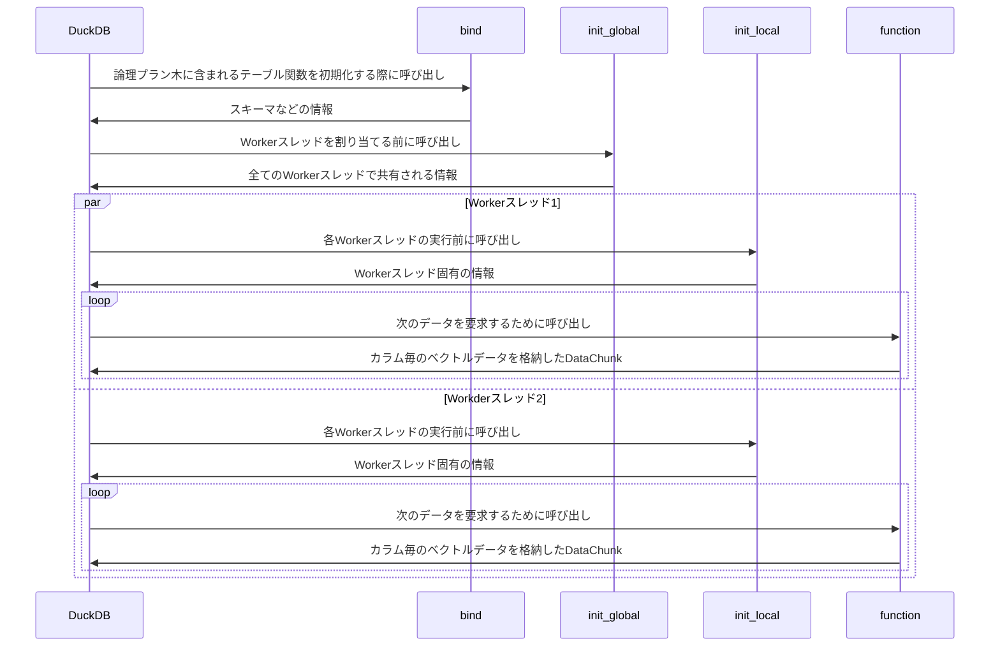

# DuckDB Extension機構を使用した拡張機能の実装に関する概要

 - [DuckDBには柔軟なExtension機構](https://duckdb.org/docs/archive/1.0/extensions/overview)があり、実行時に拡張機能を動的にロードすることができる
   - 新しいデータソース（ファイル形式や、データストア）、データキャッシュ機構、型、ドメイン固有の機能を追加することが可能
 - 本ドキュメントはDuckDBのExtension機構を使用してシンプルに実装したCSVデータを読み込むためのテーブル関数（[maropu/duckdb_scanner_example](https://github.com/maropu/duckdb_scanner_example)）を例に，拡張機能をどの様に実装すればよいかを概説する
   - 今回紹介する内容はDuckDBの[v1.1.3のソースコード](https://github.com/duckdb/duckdb/tree/v1.1.3)を使用して作成
 - 今回の説明に用いるCSVデータ読み込みのためのテーブル関数（`scan_csv_ex`）の主な仕様
   - 単一ファイルで構成されるCSVデータの読み込みは未対応
   - ヘッダの読み飛ばし機能は未対応
   - 複数のWorkerスレッドによる読み込みに対応
   - 読み込み可能な型はVARCHAR，BIGINT，DOUBLEの3種類のみ対応
   - 読み込むデータのスキーマ（名前と型）はテーブル関数呼び出し時の引数として指定することとして，スキーマ推論は未対応

```sql
D SELECT * FROM scan_csv_ex('data/test.csv', {'a': 'varchar', 'b': 'bigint', 'c': 'double'});
┌─────────┬───────┬────────┐
│    a    │   b   │   c    │
│ varchar │ int64 │ double │
├─────────┼───────┼────────┤
│ aaa     │     1 │   1.23 │
│ bbb     │     2 │   3.14 │
│ ccc     │     3 │   2.56 │
└─────────┴───────┴────────┘
```

##  必要最低限の構成要素

```bash
.
|-- CMakeLists.txt                  // Root CMake build file
|-- Makefile                        // Build script to wrap cmake
|-- data                            // Test data used in `test/sql/csv_scanner.test`
|   |-- random.csv
|   `-- test.csv
|-- duckdb                          // DuckDB source code that this extension depends on
|-- src
|   |-- CMakeLists.txt              // CMake build file to list source files
|   |-- csv_scanner_extension.cpp   // CSV parser implmenetation
|   |-- include
|   |   `-- csv_scanner.hpp         // Header file for the CSV parser
|   `-- scan_csv.cpp                // Entrypoint where DuckDB loads this extension
`-- test
    `-- sql
        `-- csv_scanner.test        // Test script
```

## DuckDBがExtensionをロードするために必要なエントリポイント

 - [`src/csv_scanner_extension.cpp`](https://github.com/maropu/duckdb_scanner_example/blob/006a12554572cdcc1c8fb01ec7bb1e0e9c9015aa/src/csv_scanner_extension.cpp)にはDuckDB上で`INSTALL/LOAD`構文を用いてExtensionを読み込む際に呼び出される初期化関数を定義する必要がある
   - 初期化時に呼び出されるシンボル名は`${EXTENSION_NAME}_init`である必要がある
   - 注意点としてMac環境でコンパイルする際には，リンク時のオプションに[`-Wl,-exported_symbol,_${EXTENSION_NAME}_init -Wl,-exported_symbol,_${EXTENSION_NAME}_version`が指定](https://github.com/duckdb/duckdb/blob/19864453f7d0ed095256d848b46e7b8630989bac/CMakeLists.txt#L834-L836)される関係で，`${EXTENSION_NAME}_version`も併せて実装する必要がある
     - ただしこの`${EXTENSION_NAME}_version`はDuckDBからExtensionのバージョンを表示する際には参照されず、現状用途は不明（詳細は後述）

 ```c++
#define DUCKDB_BUILD_LOADABLE_EXTENSION
#include "csv_scanner.hpp"

using namespace duckdb;

extern "C" {

DUCKDB_EXTENSION_API void csv_scanner_init(DatabaseInstance &db) {
	CsvScannerFunction::RegisterFunction(db);
}

DUCKDB_EXTENSION_API const char *csv_scanner_version() {
	return CSV_SCANNER_EXTENSION_VERSION;
}

}
 ```

 - Extensionのバージョンは上記で定義した`${EXTENSION_NAME}_version()`関数を使用して参照されているわけではなく，cmake実行時に指定した`-DDUCKDB_EXTENSION_${EXTENSION_NAME}_EXT_VERSION`の値をコンパイル後の共有ライブラリの末尾領域（Footer）にメタデータとして埋め込まれるデータが参照される
   - [`duckdb/scripts/append_metadata.cmake`](https://github.com/duckdb/duckdb/blob/v1.1.3/scripts/append_metadata.cmake)を使用してバージョン情報を含めた情報が共有ライブラリの末尾領域に埋め込まれる
   - 上記のバージョン情報を[`ExtensionHelper::ParseExtensionMetaData`](https://github.com/duckdb/duckdb/blob/19864453f7d0ed095256d848b46e7b8630989bac/src/main/extension/extension_load.cpp#L177-L214)で読み出して，以下のように`duckdb_extensions()`内の`extension_version`の文字列として表示している

 ```sql
 D SELECT * FROM duckdb_extensions();
 ┌──────────────────┬─────────┬───────────┬──────────────────────┬───┬───────────────────┬───────────────────┬───────────────────┬──────────────────────┐
│  extension_name  │ loaded  │ installed │     install_path     │ … │      aliases      │ extension_version │   install_mode    │    installed_from    │
│     varchar      │ boolean │  boolean  │       varchar        │   │     varchar[]     │      varchar      │      varchar      │       varchar        │
├──────────────────┼─────────┼───────────┼──────────────────────┼───┼───────────────────┼───────────────────┼───────────────────┼──────────────────────┤
│ arrow            │ false   │ false     │                      │ … │ []                │                   │                   │                      │
│ autocomplete     │ true    │ true      │ (BUILT-IN)           │ … │ []                │                   │ STATICALLY_LINKED │                      │
│ aws              │ false   │ false     │                      │ … │ []                │                   │                   │                      │
│ azure            │ false   │ false     │                      │ … │ []                │                   │                   │                      │
│ csv_scanner      │ true    │ true      │ /Users/maropu/.duc…  │ … │ []                │ v1.0.0            │ CUSTOM_PATH       │ ./build/release/ex…  │
│ delta            │ false   │ false     │                      │ … │ []                │                   │                   │                      │
│ excel            │ false   │ false     │                      │ … │ []                │                   │                   │                      │
│ fts              │ false   │ false     │                      │ … │ []                │                   │                   │                      │
│ httpfs           │ false   │ true      │ /Users/maropu/.duc…  │ … │ [http, https, s3] │ v1.1.3            │ REPOSITORY        │ core                 │
│ iceberg          │ false   │ false     │                      │ … │ []                │                   │                   │                      │
│ icu              │ true    │ true      │ (BUILT-IN)           │ … │ []                │ v1.1.3            │ STATICALLY_LINKED │                      │
│ inet             │ false   │ false     │                      │ … │ []                │                   │                   │                      │
│ jemalloc         │ false   │ false     │                      │ … │ []                │                   │                   │                      │
│ json             │ true    │ true      │ (BUILT-IN)           │ … │ []                │ v1.1.3            │ STATICALLY_LINKED │                      │
│ motherduck       │ false   │ false     │                      │ … │ [md]              │                   │                   │                      │
│ mysql_scanner    │ false   │ false     │                      │ … │ [mysql]           │                   │                   │                      │
│ parquet          │ true    │ true      │ (BUILT-IN)           │ … │ []                │ v1.1.3            │ STATICALLY_LINKED │                      │
│ postgres_scanner │ false   │ true      │ /Users/maropu/.duc…  │ … │ [postgres]        │ 03eaed7           │ REPOSITORY        │ core                 │
│ sayhello         │ false   │ true      │ /Users/maropu/.duc…  │ … │ []                │                   │ CUSTOM_PATH       │ /Users/maropu/Repo…  │
│ shell            │ true    │ true      │                      │ … │ []                │                   │ STATICALLY_LINKED │                      │
│ spatial          │ false   │ false     │                      │ … │ []                │                   │                   │                      │
│ sqlite_scanner   │ false   │ false     │                      │ … │ [sqlite, sqlite3] │                   │                   │                      │
│ substrait        │ false   │ false     │                      │ … │ []                │                   │                   │                      │
│ tpcds            │ false   │ true      │ /Users/maropu/.duc…  │ … │ []                │ v1.1.3            │ REPOSITORY        │ core                 │
│ tpch             │ false   │ true      │ /Users/maropu/.duc…  │ … │ []                │ v1.1.3            │ REPOSITORY        │ core                 │
│ vss              │ false   │ false     │                      │ … │ []                │                   │                   │                      │
├──────────────────┴─────────┴───────────┴──────────────────────┴───┴───────────────────┴───────────────────┴───────────────────┴──────────────────────┤
│ 26 rows                                                                                                                          9 columns (8 shown) │
└──────────────────────────────────────────────────────────────────────────────────────────────────────────────────────────────────────────────────────┘
```

### 補足: Extension用の共有ライブラリの末尾領域のメタデータ

 - [`duckdb/scripts/append_metadata.cmake`](https://github.com/duckdb/duckdb/blob/v1.1.3/scripts/append_metadata.cmake)によって共有ライブラリの末尾512Bの領域に以下に示すメタデータが書き込まれる
   - 前半256B領域は32B固定長の8個のメタデータが配置（下記未使用データは`\x00`で埋められている）
     - METADATA8: 未使用
     - METADATA7: 未使用
     - METADATA6: ABIの種類（'CPP'）
     - METADATA5: Extensionのバージョン（'v1.0.0'）
     - METADATA4: コンパイルに使用したDuckDBのバージョン（'v1.1.3'）
     - METADATA3: コンパイル環境が記載されたファイル`duckdb/build/release/duckdb_platform_out`の内容（'osx_amd64'）
     - METADATA2: 未使用
     - METADATA1: '4'の文字
   - 後半256B領域はデジタル署名のデータが配置（無署名の場合には`\x00`で埋められている）
     - [DuckDBのExtensionのセキュリティレベルは3段階で設定](https://duckdb.org/docs/operations_manual/securing_duckdb/securing_extensions.html#overview-of-security-levels-for-extensions)されていて，無署名な場合は最もセキュリティレベルが低く，`-unsigned`オプションを指定してDuckDBを起動（もしくは`SET allow_unsigned_extensions=true`を設定）しないとロードすることができない仕様になっている

```shell
$ tail -c 512 build/release/extension/csv_scanner/csv_scanner.duckdb_extension | hexdump -C
00000000  00 00 00 00 00 00 00 00  00 00 00 00 00 00 00 00  |................|
*
00000060  43 50 50 00 00 00 00 00  00 00 00 00 00 00 00 00  |CPP.............|
00000070  00 00 00 00 00 00 00 00  00 00 00 00 00 00 00 00  |................|
00000080  31 2e 30 2e 30 00 00 00  00 00 00 00 00 00 00 00  |v1.0.0..........|
00000090  00 00 00 00 00 00 00 00  00 00 00 00 00 00 00 00  |................|
000000a0  76 31 2e 31 2e 31 00 00  00 00 00 00 00 00 00 00  |v1.1.3..........|
000000b0  00 00 00 00 00 00 00 00  00 00 00 00 00 00 00 00  |................|
000000c0  6f 73 78 5f 61 6d 64 36  34 00 00 00 00 00 00 00  |osx_amd64.......|
000000d0  00 00 00 00 00 00 00 00  00 00 00 00 00 00 00 00  |................|
000000e0  34 00 00 00 00 00 00 00  00 00 00 00 00 00 00 00  |4...............|
000000f0  00 00 00 00 00 00 00 00  00 00 00 00 00 00 00 00  |................|
*
```

## Extensionが定義するテーブル関数の登録

 - `csv_scanner_init`に引数として渡される[`DatabaseInstance`](https://github.com/duckdb/duckdb/blob/19864453f7d0ed095256d848b46e7b8630989bac/src/include/duckdb/main/database.hpp#L40-L99)と，Extensionが定義するテーブル関数の情報（[`TableFunction`](https://github.com/duckdb/duckdb/blob/19864453f7d0ed095256d848b46e7b8630989bac/src/include/duckdb/function/table_function.hpp#L229-L313)）を[`ExtensionUtil::RegisterFunction`](https://github.com/duckdb/duckdb/blob/19864453f7d0ed095256d848b46e7b8630989bac/src/include/duckdb/main/extension_util.hpp#L28-L51)に渡すことでDuckDB内で参照可能な状態になる
 - [`TableFunction`コンストラクタ](https://github.com/duckdb/duckdb/blob/19864453f7d0ed095256d848b46e7b8630989bac/src/include/duckdb/function/table_function.hpp#L231-L234)の第1/第2引数で呼び出し関数名と引数の型を指定して，第3引数以降で実行時に呼び出されるコールバック関数を登録する（コンストラクタの各引数の意味は下記コード内に記述）
   - この例ではテーブル関数の1つ目で引数は文字列型のファイルパスを，2つ目の引数でスキーマ情報を指定する`scan_csv_ex`という名前のテーブル関数を定義（これで`scan_csv_ex('data/test.csv', {'a': 'varchar', 'b': 'bigint', 'c': 'double'})`という呼び出しが可能になる）
     - 2つ目の引数の型は`LogicalType::ANY`とすることで任意の型を許容，入力されたスキーマ情報の整合性の確認は`bind`のコールバック関数内で行う（後述）
   - 名前付きの任意の引数を定義したい場合には，[`TableFunction::named_parameters`](https://github.com/duckdb/duckdb/blob/19864453f7d0ed095256d848b46e7b8630989bac/src/include/duckdb/function/function.hpp#L141)を利用することで`scan_csv_ex(..., buffer_size=4096)`のような呼び出しが可能になる

```c++
static void ScanCsvAddNamedParameters(TableFunction &table_function) {
	table_function.named_parameters["buffer_size"] = LogicalType::UBIGINT;
}

static TableFunction GetFunction() {
	// TableFunction(string name,                                        // 定義するテーブル関数名
	//               vector<LogicalType> arguments,                      // 必須となる関数の引数
	//               table_function_t function,                          // 並列に実行されるWorkerスレッドから呼び出されるコアロジックが記述された関数
	//               table_function_bind_t bind = nullptr,               // 実行時に変更されない情報（e.g., テーブル関数が返却するデータのスキーマ）の初期化を行う関数（Optional）
	//               table_function_init_global_t init_global = nullptr, // テーブル関数を実行するWorkerスレッド全てで共有される情報の初期化を行う関数（Optional）
	//               table_function_init_local_t init_local = nullptr)   // Workderスレッド固有の情報の初期化を行う関数（Optional）
	TableFunction scan_csv("scan_csv_ex", {LogicalType::VARCHAR, LogicalType::ANY},
						   ScanCsvFunction, ScanCsvBind, ScanCsvInitGlobal, ScanCsvInitLocal);
	...
	ScanCsvAddNamedParameters(scan_csv);
	return scan_csv;
}

void CsvScannerFunction::RegisterFunction(DatabaseInstance &db) {
	ExtensionUtil::RegisterFunction(db, GetFunction());
}
```

 - 第3引数以降で渡した4つのコールバック関数`function`、`bind`、`init_global`、`init_local`は下記の流れでDuckDBから呼び出される（スレッド数が2の場合）
   - `bind`は[`planner/binder`](https://github.com/duckdb/duckdb/tree/v1.1.3/src/planner/binder)以下にある論理プラン木（SQL文から変換した検証や最適化のための内部表現）のテーブル関数を含む葉ノードを初期化するためのコードから呼び出される
   - 一方，`init_global`/`init_local`/`function`は[`execution/operator/scan`](https://github.com/duckdb/duckdb/tree/v1.1.3/src/execution/operator/scan)以下のデータ読み込みのための物理プラン木（論理プラン木から変換される実行のための内部表現）の葉ノード実装（[`PhysicalTableScan`](https://github.com/duckdb/duckdb/blob/19864453f7d0ed095256d848b46e7b8630989bac/src/include/duckdb/execution/operator/scan/physical_table_scan.hpp)）から呼び出される



## bindの実装（[`ScanCsvBind`](https://github.com/maropu/duckdb_scanner_example/blob/006a12554572cdcc1c8fb01ec7bb1e0e9c9015aa/src/scan_csv.cpp#L136-L146)）

 - 論理プラン木に含まれるテーブル関数を初期化するために呼び出される関数，第2引数で渡される`input`にテーブル関数を呼び出す際に渡した値が含まれている
   - `scan_csv_ex('data/test.csv', {'a': 'varchar', 'b': 'bigint', 'c': 'double'})`と呼び出した場合，`input.input[0]`に`data/test.csv`が，`input.input[1]`に`{'a': 'varchar', 'b': 'bigint', 'c': 'double'}`がそれぞれ設定されている
   - テーブル関数の第2引数として渡されたスキーマ情報を用いて，`bind`の引数として渡された`return_types`と`names`を更新する
   - またテーブル関数の実行時に変更されない情報を`TableFunctionData`を継承したクラスに格納して返却する

```c++
struct ScanCsvBindData : public TableFunctionData {
	...

public:
	const vector<string> column_names;
	const vector<string> column_names;
	const vector<LogicalType> column_types;
	const ScanCsvOptions options;

	shared_ptr<FileHandle> file_handle;
}

static duckdb::unique_ptr<FunctionData> ScanCsvBind(ClientContext &context, TableFunctionBindInput &input,
													vector<LogicalType> &return_types, vector<string> &names) {
  ...
	auto &file_path = StringValue::Get(input.inputs[0]);
	auto &fs = FileSystem::GetFileSystem(context);
	auto file_handle = fs.OpenFile(file_path, FileFlags::FILE_FLAGS_READ);
	ParseSchemaFromParam(context, input.inputs[1], return_types, names);
	auto options = ParseNamedParameters(input.named_parameters, context);
	auto bind_data = make_uniq<ScanCsvBindData>(names, return_types, options, std::move(file_handle));
	return std::move(bind_data);
}
```

## init_globalの実装（[`ScanCsvInitGlobal`](https://github.com/maropu/duckdb_scanner_example/blob/006a12554572cdcc1c8fb01ec7bb1e0e9c9015aa/src/scan_csv.cpp#L148-L154)）

 - DuckDBがWorkerスレッドを割り当てる前に呼び出され，全てのWorkerスレッドで共有される情報を初期化する関数
   - Workerスレッドに対して処理するべきCSVファイルの部分データを提供するためのイテレータ（[`CsvBlockIterator`](https://github.com/maropu/duckdb_scanner_example/blob/006a12554572cdcc1c8fb01ec7bb1e0e9c9015aa/src/include/csv_scanner.hpp#L66-L93)）を生成する
   - [`context.db->NumberOfThreads()`](https://github.com/duckdb/duckdb/blob/19864453f7d0ed095256d848b46e7b8630989bac/src/include/duckdb/main/database.hpp#L64)は[DuckDBのグローバルなパラメータ`threads`](https://duckdb.org/docs/configuration/overview.html)（デフォルト値は実行環境のコア数）の値を返却し，この値を用いてテーブル関数を実行する際に使用する最大Workerスレッド数を計算する（後述）

```c++
struct CsvGlobalState : public GlobalTableFunctionState {
	...

private:
	//! Because this global state can be accessed in Parallel we need a mutex.
	mutex main_mutex;

	//! Basically max number of threads in DuckDB
	idx_t system_threads;

	//! The CSV block iterator
	unique_ptr<CsvBlockIterator> csv_block_iterator;
	atomic<idx_t> reader_idx;
	bool finished;
}

static unique_ptr<GlobalTableFunctionState> ScanCsvInitGlobal(ClientContext &context, TableFunctionInitInput &input) {
	auto &bind_data = input.bind_data->Cast<ScanCsvBindData>();
	auto &allocator = BufferAllocator::Get(context);
	auto buffer_size = bind_data.options.buffer_size;
	auto csv_block_iterator = make_uniq<CsvBlockIterator>(allocator, bind_data.file_handle, buffer_size);
	return make_uniq<CsvGlobalState>(context.db->NumberOfThreads(), std::move(csv_block_iterator));
}
```

 - `CsvBlockIterator`で参照する要素は最大`buffer_size`バイト（デフォルト値は32MB）のCSVファイルの部分データを表す[`CSVBlock`](https://github.com/maropu/duckdb_scanner_example/blob/006a12554572cdcc1c8fb01ec7bb1e0e9c9015aa/src/include/csv_scanner.hpp#L47-L64)である
   - `CsvGlobalState`の一部である`CsvBlockIterator`は複数のWorkerスレッドから呼び出されるため`mutex`で排他制御する必要がある
   - 下記のコード内コメント（CSVファイルと`CSVBlock`の対応関係）で示すように，`CSVBlock`は行セパレータ（`\n`）が部分データの末尾になるように`CsvBlockIterator`の内部で調整されている
   - 異なるCSVファイルの分割方式として，一般的なDBMS-likeな処理系が採用するような処理の並列数で静的/事前にデータを等分（パーティショニング）する方法があるが，本実装はDuckDBの実行モデル（後述）に従い上記のような実装を採用している

```c++
//
// CSVファイルとCSVBlockの対応関係:
//  ________________
// |CSVBlock        | Workerスレッド1に割り当てられたCSVの部分データ
// | abc,123,1.23\n |
// | bcd,234,2.34\n |
// | cde,345,3.54\n |
// |----------------
// |CSVBlock        | Workerスレッド2に割り当てられたCSVの部分データ
// | def,456,4.56\n |
// | efg,567,5.67\n |
// | fgh,678,6.78\n |
// |----------------
// |...             |
// |...             |
// |...             |
//
struct CsvBlock {
  ...

private:
	...
	const idx_t actual_size;
	unique_ptr<CsvFileBuffer> data;
}

struct CsvBlockIterator {
public:
	...
	unique_ptr<CsvBlock> Next();
	...

private:
	Allocator &allocator;
	shared_ptr<FileHandle> file_handle;
	idx_t current_file_pos;
	idx_t buffer_size;
}
```

 - DuckDBの実行モデル: Morsel-Driven Parallelism
   - 並列数で静的にデータを等分する方式と比較して，以下の利点があると考えられている
     - スレッドに対して処理量が均等に配分しやすい
       - 静的にデータを等分した場合，述語のpushdownの最適化等によってパーティション毎の読み込みデータ量が偏る場合が多い
     - 任意の手法で圧縮されたファイルの読み込み処理を並列化可能
       - 圧縮手法によっては先頭からしか読み込みができない制約によってデータを静的に等分できない場合がある


Viktor Leis et al., "Morsel-Driven Parallelism: A NUMA-Aware Query Evaluation Framework for the Many-Core Age", Proceedings of SIGMOD, 2014, https://dl.acm.org/doi/10.1145/2588555.2610507 (論文内のFigure 4から引用)

## init_localの実装（[`ScanCsvInitLocal`](https://github.com/maropu/duckdb_scanner_example/blob/006a12554572cdcc1c8fb01ec7bb1e0e9c9015aa/src/scan_csv.cpp#L156-L175)）

- 各Workerスレッドの実行前に呼び出され，Workerスレッド固有の情報を初期化する関数
  - `CsvGlobalState`の一部である`CsvBlockIterator`を用いて，このWorkerスレッドで処理する`CSVBlock`を受け取り，DuckDBの内部データ（Morselの実装である[`DataChunk`](https://github.com/duckdb/duckdb/blob/19864453f7d0ed095256d848b46e7b8630989bac/src/include/duckdb/common/types/data_chunk.hpp#L25-L171)）にパース処理を行う[`CSVReader`](https://github.com/maropu/duckdb_scanner_example/blob/006a12554572cdcc1c8fb01ec7bb1e0e9c9015aa/src/include/csv_scanner.hpp#L95-L118)を初期化する

```c++
unique_ptr<LocalTableFunctionState> ScanCsvInitLocal(ExecutionContext &context, TableFunctionInitInput &input,
                                                     GlobalTableFunctionState *global_state_p) {
	if (!global_state_p) {
		return nullptr;
	}
	auto &global_state = global_state_p->Cast<CsvGlobalState>();
	if (global_state.IsDone()) {
		// nothing to do
		return nullptr;
	}
	auto csv_block = global_state.Next();
	if (!csv_block) {
		return nullptr;
	}
	auto reader_idx = global_state.NextCsvReaderIndex();
	auto &bind_data = input.bind_data->Cast<ScanCsvBindData>();
	auto csv_reader = make_uniq<CsvReader>(reader_idx, bind_data.column_names, bind_data.column_types,
										   std::move(csv_block));
	return make_uniq<CsvLocalState>(std::move(csv_reader));
}
```

## functionの実装（[ScanCsvFunction]()）

 - 次のデータを要求するために呼び出され，カラム毎のベクトルデータを挿入した`DataChunk`を返却する関数
   - `DataChunk`に何もデータを挿入せずに`function`の処理を終えるとDuckDBはWorkerスレッドを解放してしまうため，今処理している`CSVBlock`のパース処理が完了した場合は，`CsvGlobalState`の`CsvBlockIterator`を用いて次に処理する必要のある`CSVBlock`が存在するかどうかを確認する必要がある

```c++
static void ScanCsvFunction(ClientContext &context, TableFunctionInput &data_p, DataChunk &output) {
	...
	csv_local_state.csv_reader->Flush(output);
	if (output.size() == 0) {
		auto csv_block = csv_global_state.Next();
		if (!csv_block) {
			csv_local_state.done = true;
			return;
		}
		csv_local_state.csv_reader->UpdateBlock(std::move(csv_block));
		csv_local_state.csv_reader->Flush(output);
		D_ASSERT(output.size() > 0);
	}
}
```

 - 上記のコードの`CsvReader::Flush`では，以下の手順で`DataChunk`に最大[`STANDARD_VECTOR_SIZE`](https://github.com/duckdb/duckdb/blob/19864453f7d0ed095256d848b46e7b8630989bac/src/include/duckdb/common/vector_size.hpp#L20)（内部で定義されている`2048`の定数値）個のデータを挿入する
   - CSVデータをパースして，値を表す文字列の位置`[data_ptr+current_buffer_pos, data_ptr+current_buffer_pos+len-1]`を特定する
   - 特定した位置にある文字列を`bind`で設定したスキーマの型の値に変換する
   - 型変換した値を`DataChunk`内のベクトルデータに挿入する
 - 値を格納するための`DataChunk`内のベクトルデータ領域は，`bind`で初期化したスキーマ情報を用いてDuckDBにおける物理プラン木の実行主体である[`PipelineExecutor`](https://github.com/duckdb/duckdb/blob/19864453f7d0ed095256d848b46e7b8630989bac/src/parallel/pipeline_executor.cpp#L31-L46)が`STANDARD_VECTOR_SIZE`個の値を格納できるように事前に初期化されている
   - ベクトルデータ上の値を書き込み位置は，C++ templateで抽象化された`FlatVector::GetData`で型毎に計算される

```c++
void CsvReader::Flush(DataChunk &chunk) {
	...
	for (idx_t i = 0; i < STANDARD_VECTOR_SIZE; i++) {
		for (idx_t j = 0; j < column_types.size(); j++) {
			...
			auto &out_vec = chunk.data[j];

			switch (column_types[j].id()) {
			case LogicalTypeId::VARCHAR: {
				auto str = StringVector::AddString(out_vec, data_ptr + current_buffer_pos, len);
				FlatVector::GetData<string_t>(out_vec)[i] = str;
				break;
			}

			case LogicalTypeId::BIGINT: {
				auto iv = std::stoll(string(data_ptr + current_buffer_pos, len));
				FlatVector::GetData<int64_t>(out_vec)[i] = iv;
				break;
			}

			case LogicalTypeId::DOUBLE: {
				auto dv = std::stod(string(data_ptr + current_buffer_pos, len));
				FlatVector::GetData<double>(out_vec)[i] = dv;
				break;
			}

			default:
				throw InternalException("Unsupported Type %s", column_types[j].ToString());
			}

			current_buffer_pos += len + 1;
		}
		...
	}
}
```

### 補足: DuckDBの実行単位であるPipeline

 - DuckDBでは物理プラン木をWorkerスレッドで並列処理する単位（[Pipeline](https://github.com/duckdb/duckdb/blob/v1.1.3/src/include/duckdb/parallel/pipeline.hpp)）に分割して，それを[PipelineExecutor](https://github.com/duckdb/duckdb/blob/v1.1.3/src/include/duckdb/parallel/pipeline_executor.hpp)が実行するように実装されている
 - 下記の左図の点線で囲われている箇所が`Pipeline`，右図の色の異なる4つの矢印が各`Pipeline`内で実行されているWorkerスレッドをそれぞれ表現している


Viktor Leis et al., "Morsel-Driven Parallelism: A NUMA-Aware Query Evaluation Framework for the Many-Core Age", Proceedings of SIGMOD, 2014, https://dl.acm.org/doi/10.1145/2588555.2610507 (論文内のFigure 2から引用)

### 補足: DataCnunk（Morsel）のデータ構造の概要

 - 下記に示すコードからも分かる通り，（雑に言ってしまえば・・・）`DataChunk`は[`Vector`](https://github.com/duckdb/duckdb/blob/19864453f7d0ed095256d848b46e7b8630989bac/src/include/duckdb/common/types/vector.hpp#L78-L257)の列（`std::vector<Vector>`）で，`Vector`は主に2つの[`VectorBuffer`](https://github.com/duckdb/duckdb/blob/19864453f7d0ed095256d848b46e7b8630989bac/src/include/duckdb/common/types/vector_buffer.hpp#L69-L137)（`buffer`と`auxiliary`）から構成され，`VectorBuffer`は`STANDARD_VECTOR_SIZE`個の値を格納するために必要なメモリ領域（`data`）を保持する
   - `data`が示すメモリ領域は[`Allocator`](https://github.com/duckdb/duckdb/blob/19864453f7d0ed095256d848b46e7b8630989bac/src/include/duckdb/common/allocator.hpp#L85-L132)（デフォルトでは内部で`malloc`を使用した実装）経由で確保される
 - `Vector`への値の格納方法
   - 固定長の型（BIGINTとDOUBLE）の場合、型のサイズから`buffer`上の書き込み位置が簡単に計算できるため、計算された書き込み位置に値を単純に格納する（`auxilaiary`は使用されない）
   - 可変長の文字列の型（VARCHAR）の場合，可変長の文字列データは`auxiliary`に格納して，文字列データが格納された`auxiliary`上のメモリアドレスと文字列長などから構成される[`string_t`型の16B固定長データ](https://github.com/duckdb/duckdb/blob/19864453f7d0ed095256d848b46e7b8630989bac/src/include/duckdb/common/types/string_type.hpp#L223-L233)を`buffer`に格納する
     - 12B以下の文字列データの場合には`auxiliary`は使用されず，`string_t`型の固定長データに直接埋め込まれる

 ```c++
 //!  A Data Chunk represents a set of vectors.
/*!
    The data chunk class is the intermediate representation used by the
   execution engine of DuckDB. It effectively represents a subset of a relation.
   It holds a set of vectors that all have the same length.

    DataChunk is initialized using the DataChunk::Initialize function by
   providing it with a vector of TypeIds for the Vector members. By default,
   this function will also allocate a chunk of memory in the DataChunk for the
   vectors and all the vectors will be referencing vectors to the data owned by
   the chunk. The reason for this behavior is that the underlying vectors can
   become referencing vectors to other chunks as well (i.e. in the case an
   operator does not alter the data, such as a Filter operator which only adds a
   selection vector).

    In addition to holding the data of the vectors, the DataChunk also owns the
   selection vector that underlying vectors can point to.
*/
class DataChunk {
public:
	...
	vector<Vector> data
	...
};

//! Vector of values of a specified PhysicalType.
class Vector {
	...
	/*!
	    Create a new vector
	    If create_data is true, the vector will be an owning empty vector.
	    If zero_data is true, the allocated data will be zero-initialized.
	*/
	DUCKDB_API Vector(LogicalType type, bool create_data, bool zero_data, idx_t capacity = STANDARD_VECTOR_SIZE);
	...
protected:
	//! The vector type specifies how the data of the vector is physically stored (i.e. if it is a single repeated
	//! constant, if it is compressed)
	VectorType vector_type;
	//! The type of the elements stored in the vector (e.g. integer, float)
	LogicalType type;
	//! A pointer to the data.
	data_ptr_t data;
	//! The validity mask of the vector
	ValidityMask validity;
	//! The main buffer holding the data of the vector
	buffer_ptr<VectorBuffer> buffer;
	//! The buffer holding auxiliary data of the vector
	//! e.g. a string vector uses this to store strings
	buffer_ptr<VectorBuffer> auxiliary
};

//! The VectorBuffer is a class used by the vector to hold its data
class VectorBuffer {
	...
protected:
	VectorBufferType buffer_type;
	unique_ptr<VectorAuxiliaryData> aux_data;
	unsafe_unique_array<data_t> data;
	...
};
 ```


## その他の付加的な機能追加

 - 前記の`Extensionが定義するテーブル関数の登録`の項目では省略したが，`TableFunction`内のフィールド変数に値を代入することでテーブル関数の挙動を変更することができる
   - テーブル関数に関するメタデータの提供
   - 複数のWorkerスレッドの割り当てへの対応
   - 進捗状況（プログレスバー）の表示
   - テーブル関数の情報のバイト列への変換
   - 述語/射影のプッシュダウンの対応

```c++
static TableFunction GetFunction() {
	TableFunction scan_csv("scan_csv_ex", {LogicalType::VARCHAR, LogicalType::ANY},
						   ScanCsvFunction, ScanCsvBind, ScanCsvInitGlobal, ScanCsvInitLocal);
	scan_csv.to_string = ScanCsvToString;
	scan_csv.table_scan_progress = ScanCsvProgress;
	scan_csv.get_batch_index = ScanCsvGetBatchIndex;
	scan_csv.cardinality = ScanCsvCardinality;
	scan_csv.serialize = ScanCsvSerializer;
	scan_csv.deserialize = ScanCsvDeserializer;
  ...
	scan_csv.projection_pushdown = false;
	scan_csv.filter_pushdown = false;
	scan_csv.pushdown_complex_filter = nullptr;
	...
	return scan_csv;
}
```

### テーブル関数に関するメタデータの提供

 - `TableFunction::to_string`と`TableFunction::cardinality`にコールバック関数を代入することでテーブル関数に関係する論理/物理プラン木の葉ノードにメタデータ（名前や統計情報）を提供することができる

```c++
static string ScanCsvToString(const FunctionData *bind_data_p) {
	auto &bind_data = bind_data_p->Cast<ScanCsvBindData>();
	return bind_data.file_handle->file_system.ExtractName(bind_data.file_handle->GetPath());
}

static unique_ptr<NodeStatistics> ScanCsvCardinality(ClientContext &context, const FunctionData *bind_data_p) {
	auto &bind_data = bind_data_p->Cast<ScanCsvBindData>();
	auto estimated_row_width = bind_data.column_names.size() * 5;
	auto per_file_cardinality = bind_data.file_handle->GetFileSize() / estimated_row_width;
	return make_uniq<NodeStatistics>(per_file_cardinality);
}
```

 - 例えば上記にコールバック関数を代入した場合，EXPLAINで表示される物理プラン木の葉ノード（`SCAN_CSV_EX`）上に追加の情報が表示されるようになる

```sql
D EXPLAIN SELECT count(1) FROM scan_csv_ex('data/random.csv', {'a': 'varchar', 'b': 'bigint', 'c': 'double'});

┌─────────────────────────────┐
│┌───────────────────────────┐│
││       Physical Plan       ││
│└───────────────────────────┘│
└─────────────────────────────┘
┌───────────────────────────┐
│    UNGROUPED_AGGREGATE    │
│    ────────────────────   │
│        Aggregates:        │
│        count_star()       │
└─────────────┬─────────────┘
┌─────────────┴─────────────┐
│         PROJECTION        │
│    ────────────────────   │
│             0             │
│                           │
│        ~314450 Rows       │
└─────────────┬─────────────┘
┌─────────────┴─────────────┐
│        SCAN_CSV_EX        │
│    ────────────────────   │
│         random.csv        │
│                           │
│        ~314450 Rows       │
└───────────────────────────┘
--
-- 参考: `ScanCsvToString`と`ScanCsvCardinality`を代入しない場合のEXPLAINの結果
-- ┌─────────────────────────────┐
-- │┌───────────────────────────┐│
-- ││       Physical Plan       ││
-- │└───────────────────────────┘│
-- └─────────────────────────────┘
-- ┌───────────────────────────┐
-- │    UNGROUPED_AGGREGATE    │
-- │    ────────────────────   │
-- │        Aggregates:        │
-- │        count_star()       │
-- └─────────────┬─────────────┘
-- ┌─────────────┴─────────────┐
-- │         PROJECTION        │
-- │    ────────────────────   │
-- │             0             │
-- │                           │
-- │          ~1 Rows          │
-- └─────────────┬─────────────┘
-- ┌─────────────┴─────────────┐
-- │        SCAN_CSV_EX        │
-- │    ────────────────────   │
-- │   Function: SCAN_CSV_EX   │
-- │                           │
-- │          ~1 Rows          │
-- └───────────────────────────┘
```

### 複数のWorkerスレッドの割り当てへの対応

 - デフォルトでは割り当てられるWorkerスレッド数は1に設定されているため，複数のWorkerスレッドを使用してテーブル関数を実行したい（`function`を複数のWorkerスレッドで実行したい）場合には以下2つの実装が必要になる
   - `GlobalTableFunctionState::MaxThreads`をオーバライドしてテーブル関数を実行するために必要なスレッド数を指定する
   - `TableFunction::get_batch_index`にテーブル関数を実行するWorkerスレッド毎にユニークなIDを返却するコールバック関数を登録する

```c++
struct CsvGlobalState : public GlobalTableFunctionState {
public:
	...
	//! Calculates the Max Threads that will be used by this CSV Scanner
	idx_t MaxThreads() const override {
		idx_t total_threads = csv_block_iterator->GetFileSize() / csv_block_iterator->GetBufferSize() + 1;
		if (total_threads < system_threads) {
			return total_threads;
		}
		return system_threads;
	}
	...
}

static idx_t ScanCsvGetBatchIndex(ClientContext &context, const FunctionData *bind_data_p,
								  LocalTableFunctionState *local_state, GlobalTableFunctionState *global_state) {
	return (local_state->Cast<CsvLocalState>()).csv_reader->GetReaderIndex();
}
```

### 進捗状況（プログレスバー）の表示

 - CSVファイルサイズと現在の読み込み位置を表す`CsBlockIterator::current_file_pos`から処理の進捗率（[0, 100.0]）を計算して返却することで，DuckDBのフロントエンド上のプログレスバーが表示されるようになる

```c++
static double ScanCsvProgress(ClientContext &context, const FunctionData *bind_data_p,
							  const GlobalTableFunctionState *global_state) {
	if (!global_state) {
		return 0.0;
	}
	auto &data = global_state->Cast<CsvGlobalState>();
	return data.GetProgress();
}
```


### テーブル関数の情報のバイト列への変換

 - `LogicalPlan::Serialize`/`LogicalPlan::Deserialize`を用いて論理プラン木をコピー可能にする挙動を追加できる
   - DuckDBの通常使用において現状では呼び出されることが無いため未実装でも大丈夫，実際に公式のExtensionの[duckdb/postgres_scanner](https://github.com/duckdb/postgres_scanner/blob/03eaed75f0ec5500609b7a97aa05468493b229d1/src/postgres_scanner.cpp#L526-L533)でも未実装である

```c++
static void ScanCsvSerializer(Serializer &serializer, const optional_ptr<FunctionData> bind_data_p,
							  const TableFunction &function) {
	throw NotImplementedException("ScanCsvSerialize");
}

static unique_ptr<FunctionData> ScanCsvDeserializer(Deserializer &deserializer, TableFunction &function) {
	throw NotImplementedException("ScanCsvDeserialize");
}
```

 - テストコードを眺めると[Client APIs](https://duckdb.org/docs/api/overview.html)からの利用が想定されているようなので，例えば論理プランの部分木を他のマシンにディスパッチして分散処理，のようなDuckDBを組み込んだ3rd-party製の処理系を作る際には便利そう

```c++
TEST_CASE("Generate serialized plans file", "[.][serialization]") {
	...
	DuckDB db;
	Connection con(db);
	load_db(con);
	BufferedFileWriter target(db.GetFileSystem(), file_location);
	std::ifstream queries(get_full_file_name("queries.sql"));
	string query;
	while (std::getline(queries, query)) {
		con.BeginTransaction();
		Parser p;
		p.ParseQuery(query);

		Planner planner(*con.context);

		planner.CreatePlan(std::move(p.statements[0]));
		auto plan = std::move(planner.plan);

		BinarySerializer serializer(target);
		serializer.Begin();
		plan->Serialize(serializer);
		serializer.End();

		con.Rollback();
	}

	target.Sync();

	test_deserialization(file_location);
}
```
[duckdb/test/api/serialized_plans/test_plan_serialization_bwc.cpp](https://github.com/duckdb/duckdb/blob/v1.1.3/test/api/serialized_plans/test_plan_serialization_bwc.cpp)

### 述語/射影のプッシュダウンの対応

 - 今回は未調査
   - [duckdb/postgres_scanner](https://github.com/duckdb/postgres_scanner/blob/03eaed75f0ec5500609b7a97aa05468493b229d1/src/postgres_scanner.cpp#L557-L558)がサポートしているため，興味がある場合には要参照

## DuckDBのテストフレームワークに関して

 - DuckDBのテストコードはC++のテスト用のライブラリである[Catch2]()を用いて実装された[duckdb/test/unittest.cpp](https://github.com/duckdb/duckdb/blob/v1.1.3/test/unittest.cpp)で実行され、Extensionで実装したテーブル関数のテストにもこのテストフレームワークを利用することができる
 - cmake実行時に指定した`-DDUCKDB_EXTENSION_${EXTENSION_NAME}_TEST_PATH`のディレクトリ以下に存在するテストスクリプト（e.g., `xxx.test`）の内容を、`duckdb/test/unittest`が内部で`Catch2`を利用して実行する
   - テストスクリプトとして認識される拡張子は[`.test`、`.test_slow`、`.test_coverage`の3種類](https://github.com/duckdb/duckdb/blob/19864453f7d0ed095256d848b46e7b8630989bac/test/sqlite/test_sqllogictest.cpp#L214-L223)である、通常のテストは拡張子が`.test`のファイルに記述すればよく、他の拡張子はテストの実行有無を切り替えるために用意されている
 - `make test`で`duckdb/test/unittset.cpp`がコンパイルされたバイナリ（`./build/release/$(TEST_PATH)`）が実行され、以下のようなテスト結果が表示される仕組みである

```makefile
test_release: release
	./build/release/$(TEST_PATH) --test-dir "$(PROJ_DIR)" "test/*"
```
https://github.com/maropu/duckdb_scanner_example/blob/006a12554572cdcc1c8fb01ec7bb1e0e9c9015aa/Makefile#L71-L72

```shell
$ make test
...
[1/1] (100%): test/sql/csv_scanner.test
===============================================================================
All tests passed (13 assertions in 1 test case)
```

 - テストスクリプトはSQLiteの[`Sqllogictest`](https://sqlite.org/sqllogictest/doc/trunk/about.wiki)とほぼ同様の記法を採用している
   - 実のところ2018年8月に[`Sqllogictest`のコード](https://sqlite.org/sqllogictest/dir?ci=tip)を`duckdb/test/sqlite`以下にコピーして、それを改良しながら利用していることが[GitHubのcommitの履歴](https://github.com/duckdb/duckdb/commit/ae8c32678243dd63f39a66acc1e490a26abd6d2d#diff-c883adf6344584b21df866a28db0dfb7306d0e4bdb58c498a40aa3a9d7ceffeb)から確認できる
 - 具体的なテストスクリプトは以下のような内容になっていて、`query`や`statement`などのメタコマンド（後述）を使用して実装したテーブル関数に関するテストを記述する

```sql
# name: test/sql/csv_scanner.test
# description: Run tests for the csv scanner table functions
# group: [csv_scanner]

require csv_scanner

query TIR
SELECT * FROM scan_csv_ex('data/test.csv',
						  {'a': 'varchar', 'b': 'bigint', 'c': 'double'});
----
aaa	1	1.23
bbb	2	3.14
ccc	3	2.56

query IRR
SELECT count(1), sum(b), sum(c)
FROM scan_csv_ex('data/random.csv',
				 {'a': 'varchar', 'b': 'bigint', 'c': 'double'});
----
300000	15156364	15041450.940000182

statement error
SELECT COUNT(1), SUM(b), SUM(c)
FROM scan_csv_ex('data/random.csv',
				 {'a': 'varchar', 'b': 'bigint', 'c': 'double'},
				 buffer_size=12);
----
buffer_size must be at least 1024 bytes
```
https://github.com/maropu/duckdb_scanner_example/blob/006a12554572cdcc1c8fb01ec7bb1e0e9c9015aa/test/sql/csv_scanner.test


### SQLのテストスクリプト内で使用可能なメタコマンド

 - 使用可能なメタコマンドは[duckdb/test/sqlite/sqllogic_parser.hpp](https://github.com/duckdb/duckdb/blob/19864453f7d0ed095256d848b46e7b8630989bac/test/sqlite/sqllogic_parser.hpp#L17-L39)に定義されている20種類である、ここではExtensionで実装するテーブル関数のテストに使用しそうな主要なものだけを取り上げる
   - ここで紹介するメタコマンドの多くは[`Sqllogictest`のドキュメント](https://www.sqlite.org/sqllogictest/doc/trunk/about.wiki)でも説明されているため、併せて参照した方が良い

```c++
enum class SQLLogicTokenType {
	SQLLOGIC_INVALID,
	SQLLOGIC_SKIP_IF,
	SQLLOGIC_ONLY_IF,
	SQLLOGIC_STATEMENT,
	SQLLOGIC_QUERY,
	SQLLOGIC_HASH_THRESHOLD,
	SQLLOGIC_HALT,
	SQLLOGIC_MODE,
	SQLLOGIC_SET,
	SQLLOGIC_LOOP,
	SQLLOGIC_FOREACH,
	SQLLOGIC_CONCURRENT_LOOP,
	SQLLOGIC_CONCURRENT_FOREACH,
	SQLLOGIC_ENDLOOP,
	SQLLOGIC_REQUIRE,
	SQLLOGIC_REQUIRE_ENV,
	SQLLOGIC_LOAD,
	SQLLOGIC_RESTART,
	SQLLOGIC_RECONNECT,
	SQLLOGIC_SLEEP,
	SQLLOGIC_UNZIP
}
```

- `statement`（`SQLLOGIC_STATEMENT`）
  - SQL文の成功or失敗をテストするための命令で、失敗を期待するテストでは出力されるエラーメッセージの内容も記述する

```sql
statement ok
CREATE TABLE t (a INT);

statement error
CREATE TABLE t (a INT);
---
Catalog Error: Table with name "t" already exists!
```

 - `query`（`SQLLOGIC_QUERY`）
   - relationの結果を返却するSQL文をテストするための命令で、期待される結果を記述する
   - `query`の後に出力内容に期待される列数分だけの型情報（`VARCHAR`なら`T`、`BIGINT`なら`I`、`DOUBLE`なら`R`）を列挙する、例えばスキーマが`(a: VARCHAR, b: BIGINT, c: DOUBLE)`である場合には`query TIR`と記述する

```sql
query TIR
SELECT 'aaa', 1, 1.23;
---
aaa	1	1.23
```

 - `require`（`SQLLOGIC_REQUIRE`）
   - 引数で与えたExtensionがロード可能であるか、可能である場合はロード出るかをテストする
   - Extensionのテストには使うことは無いと思うが、[DuckDBの内部パラメータやコンパイル条件などのテスト](https://github.com/duckdb/duckdb/blob/19864453f7d0ed095256d848b46e7b8630989bac/test/sqlite/sqllogic_test_runner.cpp#L304-L439)にも利用されている

```sql
require some_extension
```

 - `require-env`（`SQLLOGIC_REQUIRE_ENV`）
   - 引数で与えた環境変数が定義されているかをテストする、`require-env SOME_ENV 1`と書くことで環境変数`SOME_ENV`の値が1であるかも確認する

```sql
require-env SOME_ENV
```

 - `loop`（`SQLLOGIC_LOOP`）、`concurrentloop`（`SQLLOGIC_CONCURRENT_LOOP`）、`endloop`（`SQLLOGIC_ENDLOOP`）
   - 引数として与えた整数の範囲`[start, end]`で`end-start+1`回のループ処理を行う
   - `iterator_name`は`[start, end]`のいずれかの整数が代入されたループ変数として`${iterator_name}`のように参照可能
   - `loop`を`concurrentloop`に置き換えるとスレッドで並列化される

```sql
# loop [iterator_name] [start] [end]
loop i 0 4

query TIR
SELECT * FROM 'data/test_${i}.csv';
---
...

endloop
```

 - `foreach`（`SQLLOGIC_FOREACH`）、`concurrent_foreach（``SQLLOGIC_CONCURRENT_FOREACH`）、`endloop`（`SQLLOGIC_ENDLOOP`）
   - 引数として与えたリストの要素を順に、リストの要素数だけのループ処理を行う
   - `iterator_name`はリストのいずれかの要素が代入されたループ変数として`${iterator_name}`のように参照可能
   - `foreach`を`concurrentforeach`に置き換えるとスレッドで並列化される

```sql
# foreach [iterator_name] [m1] [m2] [etc...]
foreach arg p1 p2 p3 p4

query TIR
SELECT * FROM func("${arg}");
---
...

endloop
```

 - `onlyif`（`SQLLOGIC_ONLY_IF`）、`skipif`（`SQLLOGIC_SKIP_IF`）
   - `onlyif`は条件が真の時にテストを行い、`skipif`は条件が真の時にはテストを行わない

```sql
foreach state init test

onlyif state=init
statement ok
CREATE TABLE t (a INT, b VARCHAR);

onlyif state=init
statement ok
INSERT INTO t VALUES (1, 'aaa');

skipif state=init # or , `onlyif state=test`
query IT
SELECT * FROM t;
---
1	aaa

endloop
```

 - `mode`（`SQLLOGIC_MODE`）
   - `mode skip`と`mode unskip`の間のテストの実行を行わない

```sql
mode skip

statement ok
CREATE TABLE t (a UNSUPPORTED_TYPE);

mode unskip
```

 - `load`（`SQLLOGIC_LOAD`）
   - 引数として渡されたDBファイルを読み込む
   - 以下で使用されている予約語`__TEST_DIR__`はテスト実行環境に合わせて置換される，使用可能な予約語は以下3つである
     - `__TEST_DIR__`: テストで使用する一時領域のパス、デフォルトでは`duckdb_unittest_tempdir`
     - `__WORKING_DIRECTORY__`: `unistd.h#getcwd()`が返す値
	 - `__BUILD_DIRECTORY__`: `duckdb/build/release`の様にビルド条件に応じた出力先のパス

```sql
load __TEST_DIR__/mydb.db
```

## スレッド並列化による性能向上の寄与は？

 - Mac環境（2.3 GHz Quad-Core Intel Core i7）上でのDuckDB組み込み関数`read_csv`との性能比較
   - 約10GBのVARCHAR,BIGINT,DOUBLEの3列からなるCSVデータ（乱数により生成した人工データ）
   - さすがの公式実装（`read_csv`），コア数までほぼ線形に速度が向上しているが，一方本実装（`scan_csv_ex`）は・・・


## まとめ

 - 比較的簡単にExtionsionを実装して，DuckDBにロードして使用することが可能！
 - Happy Hacking!
