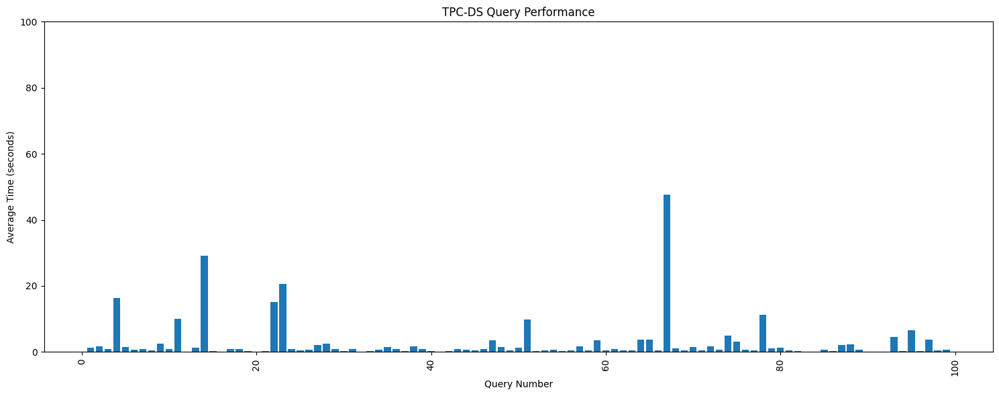

# DuckDBの概要

 - OSS(MIT)のカラム指向なOLAP向けの組み込みDBMS
   - SQLiteと同様に他のライブラリへの依存が無い単一バイナリで処理が完結，またDBデータも単一ファイルで構成されるためPortabilityが高い
   - 2019年に初めてリリースされ，2024.6にv1.0がリリース
   - なぜDuck？
     - [泳げる，歩ける，飛べる，さらに環境変化にも強い素晴らしい動物であるため](https://duckdb.org/faq#why-call-it-duckdb)
   - CWI所属のDBMS研究開発で有名なグループ発のOSS，直前の取り組みであるMonetDBLiteの活動を活かして開発された，とのこと
     - Mark Raasveldt, MonetDBLite: An Embedded Analytical Database, Proceeding of SIGMOD, 2018, https://dl.acm.org/doi/10.1145/3183713.3183722
 - （自分が興味を持った）技術的な特徴
   - JITコンパイルはせずに，vector-at-a-timeかつスレッド並列による実行を行うpush-basedな方式を採用
     - PostgreSQLのような従来のDBMSはtuple-at-a-timeな実行を行うpull-basedな方式（Volcano）を採用
     - JITコンパイルは他のライブラリの依存が発生するため不採用，とのこと
     - 実行方式に関しては，以下の論文を参考に実装
       - Viktor Leis et al., "Morsel-Driven Parallelism: A NUMA-Aware Query Evaluation Framework for the Many-Core Age", Proceedings of SIGMOD, 2014, https://dl.acm.org/doi/10.1145/2588555.2610507
   - PostgreSQL縁のSQLパーサの実装を取り込んでいるため，PostgreSQL独自の記法も一部サポート（e.g., 型のキャスト）
   - CWIの最新の研究成果も取り込みつつ，DBファイルの圧縮率も改善中
     - [使用されている圧縮アルゴリズム](https://duckdb.org/docs/internals/storage#compression-algorithms)
       - Constant Encoding
       - Run-Length Encoding (RLE)
       - Bit Packing
       - Frame of Reference (FOR)
       - Dictionary Encoding
       - Fast Static Symbol Table (FSST) – VLDB 2020 paper
       - Adaptive Lossless Floating-Point Compression (ALP) – SIGMOD 2024 paper
       - Chimp – VLDB 2022 paper
       - Patas
   - ブラウザ上でも動作可能（DuckDB/wasm）
     - https://shell.duckdb.org/

# なぜ興味を持ったか？

 - 以下の記事を読んで，jqの代替として使い始めたため（jqのオプションが覚えられなかった・・・）
   - [DuckDB as the New jq](https://www.pgrs.net/2024/03/21/duckdb-as-the-new-jq/)
 - TPC-Hにおいて従来DBMS（PostgreSQL，MySQL，SQLite）と比較して20-40x程度高速，という発表をみかけたため
   - https://www.youtube.com/clip/UgkxeKn053m8k3ioR-Hk1ZGPLzFjmXit4uG1, FOSDEM2020

# TPC-DS(sf=10)を使用した簡易な性能評価

  - DuckDB v1.1.1 vs PostgreSQL v16
  - Google Colab (free tier)環境上で性能測定
    - Intel(R) Xeon(R) CPU @ 2.20GHz，2cores
    - 測定に使用した実験条件: [Notebook](../20241017_duckdb_benchmarks/duckdb_postgres_benchmarks.ipynb)
  - DuckDBが圧倒的に高速（上図はDuckDBとPostgreSQLの処理時間を併記，下図はDuckDBのみ）
	- PostgreSQLはq1/q4/q11/q14/q30/q54/q60/q81/q95でtimeoutが発生（恐らく相関サブクエリの影響），一方DuckDBは相関サブクエリをプランナが非相関化してくれるので問題なく処理を完了できている
	  - [Correlated Subqueries in SQL](https://duckdb.org/2023/05/26/correlated-subqueries-in-sql.html)
    - 処理が完了したクエリの範囲内だとq56で2000倍近い性能差

  - 公式から配布されているDuckDBに標準で組み込まれている`postgres_scanner`（PostgreSQLのデータを読み込むための公式のExtension）を使用した性能も測定
    - コア数が少ない（#cores=2）にも関わらずDuckDBの処理時間のほうが速くなるケースがある点が面白い
    - `postgres_scanner`ではPostgreSQLからのデータ読込みを巧みに並列化しているので，コア数の多い環境では全てのクエリでPostgreSQLに勝てるかも？
      - [Querying Postgres Tables Directly from DuckDB](https://duckdb.org/2022/09/30/postgres-scanner.html)

